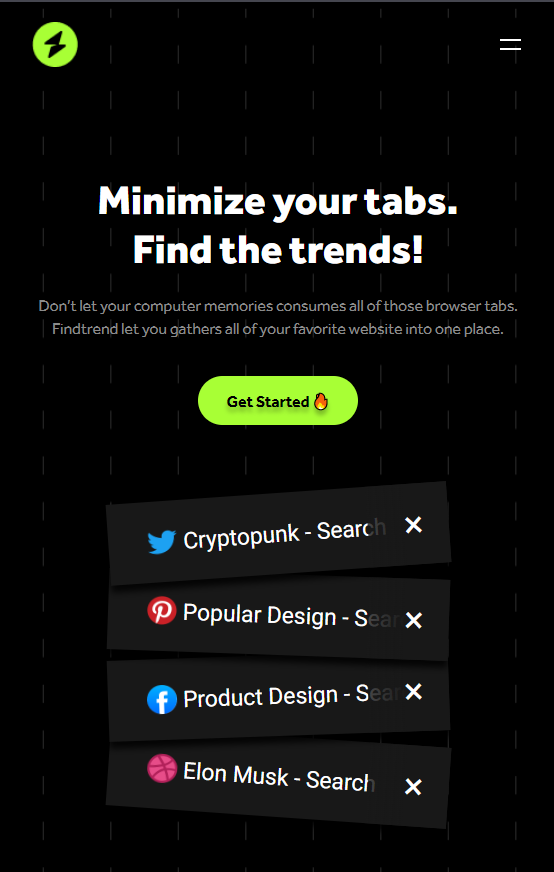

# Findtrend

## Table of contents

- [Overview](#overview)
  - [Screenshot](#links)
  - [Links](#links)
- [My process](#my-process)
  - [Built with](#built-with)
  - [What I learned](#what-i-learned)
  - [Continued development](#continued-development)

## Overview

### Screenshot

Desktop

Mobile

### Links

- Solution URL: [https://github.com/alechekhova/QR-code-component](https://github.com/alechekhova/Findtrend)
- Live Site URL: [https://alechekhova.github.io/QR-code-component/](https://alechekhova.github.io/Findtrend/)

## My process

### Built with

- Semantic HTML5 markup
- CSS
- Vanilla JS

### What I learned

This is my first big Web project that really helped to use what I learned in practice
This project helped me learn to:
- Not to be scared of big projects
- Plan markup quickly in my head by looking at the Figma styles
- Make website responsive
- Make simple animations (burger menu)
- Make modals
- Make media queries for mobile version

